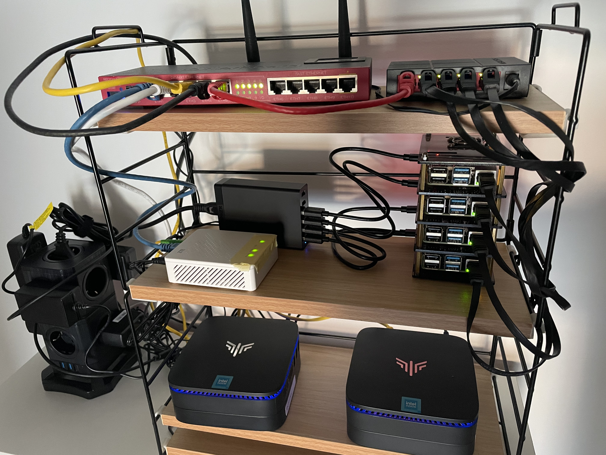
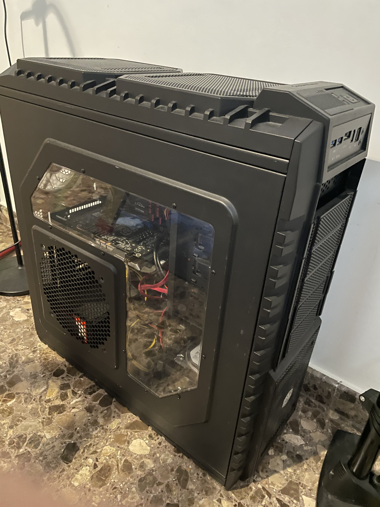
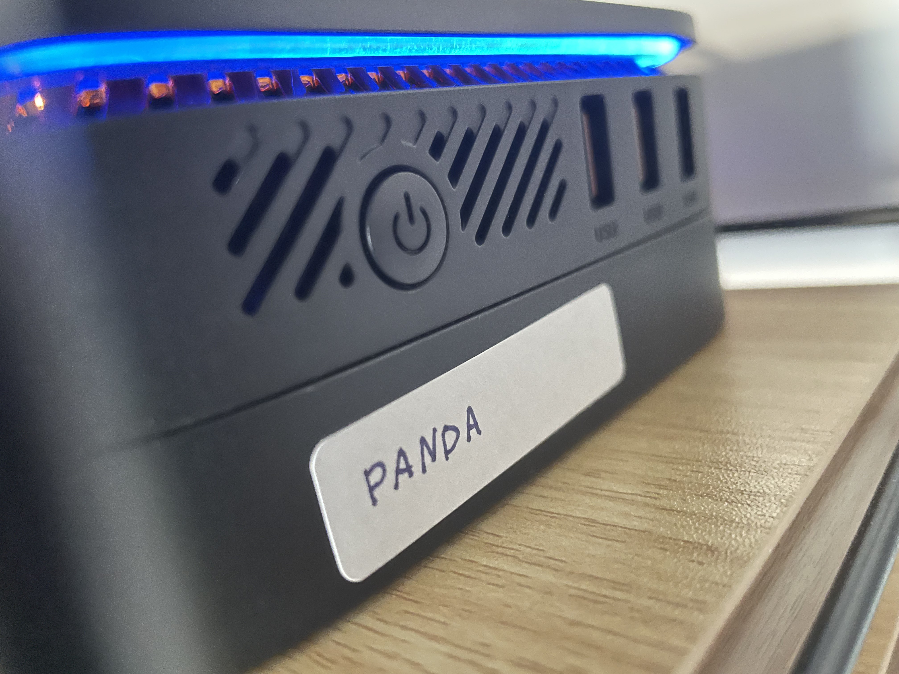
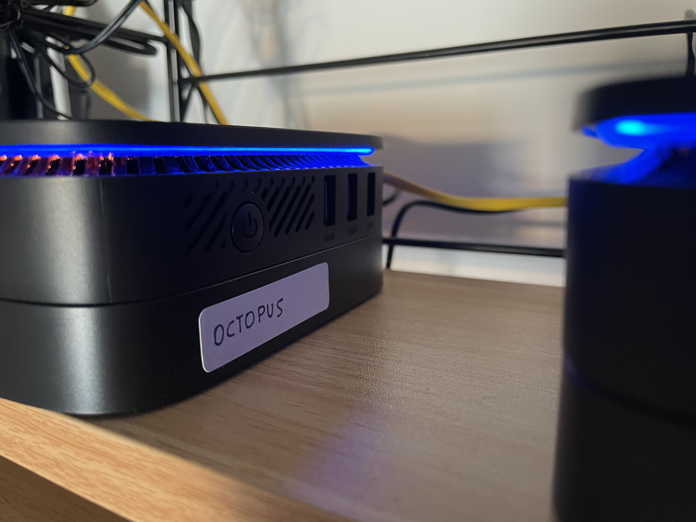
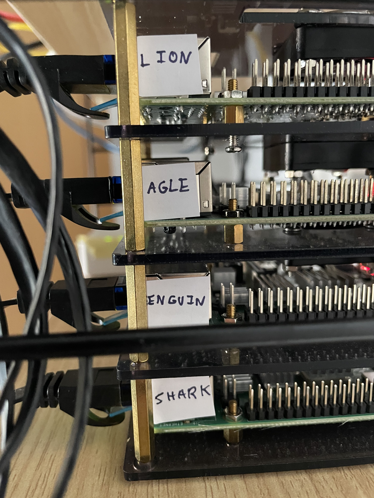
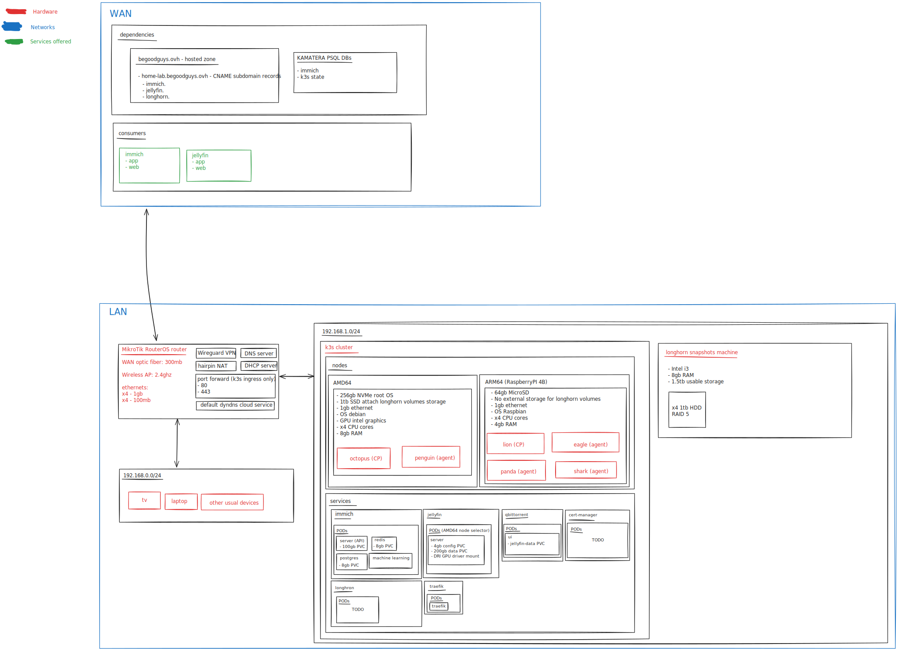

# home-lab-nexus

# 🏠💻 Home Lab Configuration

This repository documents how I configured my self-hosted home lab servers, with Kubernetes, virtual machines, and other infrastructure elements. Visual evidence, testing procedures, and detailed configurations are included to help you understand and replicate this setup.

---

### 📑 Table of Contents

1. [Overview](#overview)
2. [Hardware](#hardware)
3. [Networking Setup](#networking-setup)
4. [Kubernetes Cluster Configuration](#kubernetes-cluster-configuration)
5. [Infrastructure as Code (IaC)](#infrastructure-as-code-iac)
6. [Monitoring and Logging](#monitoring-and-logging)
7. [Testing the Setup](#testing-the-setup)
8. [Visual Evidence](#visual-evidence)
9. [Lessons Learned](#lessons-learned)

---

## 🗒️ Overview

This home lab setup features:

- **Bare-metal Kubernetes cluster** for container orchestration.
- **Virtual Machines** for running auxiliary services.
- **Networking configuration** with VLANs and proper segmentation.
- **Infrastructure as Code (IaC)** via Terraform and Pulumi.
- **Monitoring and Logging** using Prometheus, Grafana, and Loki.

The goal of this setup is to create a reliable environment for experimenting with backend development, DevOps tooling, and self-hosted applications.

---

## 🛠️ Hardware

| **Component**       | **Details**                                                                                                                                   |
| ------------------- | --------------------------------------------------------------------------------------------------------------------------------------------- |
| **k3s AMD64**       | [2x NiPoGi AK1Plus Mini PC](https://www.amazon.es/dp/B099KMCT4X?ref=ppx_yo2ov_dt_b_fed_asin_title&th=1)                                       |
| **k3s ARM64**       | [Raspberry Pi 4 4gb for lightweight tasks](https://www.raspberrypi.com/products/raspberry-pi-4-model-b/)                                      |
| **Power suppliers** | [Anker PowerPort 6 Charger USB 60W with 6 ports](https://www.amazon.es/gp/product/B00PTLSH9G/ref=ppx_yo_dt_b_search_asin_title?ie=UTF8&psc=1) |
| **Storage**         | 1.5tb RAID 5 x4 1tb HDDs backup server (old AMD64 machine)                                                                                    |
| **Networking**      | [Mikrotik L009UiGS-2HaxD-IN](https://mikrotik.com/product/l009uigs_2haxd_in)                                                                  |
| **Switches**        | [MERCUSYS HUB Switch 5 PTOS 10/100/1000](https://www.amazon.es/gp/product/B07RK6CVS3/ref=ppx_yo_dt_b_search_asin_title?ie=UTF8&psc=1)         |

---

## 🌐 Networking Setup

### VLAN Configuration

| **VLAN ID** | **Purpose**                      | **Subnet**       |
| ----------- | -------------------------------- | ---------------- |
| 10          | Home devices                     | `192.168.0.0/24` |
| 20          | Kubernetes Nodes and backup host | `192.168.1.0/24` |

## ☸️ Kubernetes Cluster Configuration

### Cluster Details

- **Nodes**: 4 Worker Nodes, 2 Control Plane
- **Container Runtime**: `docker`
- **CNI**: Calico
- **Ingress**: TRAEFIK Ingress Controller
- **Storage**: Longhron [best-effort](https://documentation.suse.com/cloudnative/storage/1.7.0/en/longhorn-system/settings.html#_default_data_locality) data locality

## 📜 Infrastructure as Code (IaC)

- Pulumi for Kubernetes and Helm chart deployments: https://github.com/bounteous17/pulumi-kubernetes-home-lab
- Ansible for k3s nodes provisioning and managenent:
  - https://github.com/k3s-io/k3s-ansible
  - https://github.com/bounteous17/ansible-home-lab

## 📝 Lessons Learned

- **Networking Complexity**: VLANs help, but troubleshooting misconfigurations can be time-consuming.
- **Storage Redundancy**: RAID 5 provides a good balance between redundancy and capacity.
- **Automation**: IaC tools (Ansible and Pulumi) streamline configuration, but maintaining them requires diligence.

## 🖼️ Image Gallery

### Diagram

